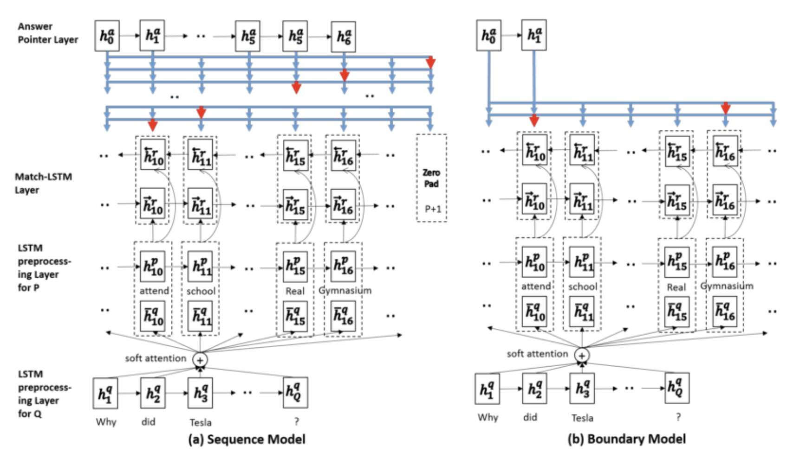

1. 引言

    机器阅读理解是近期自然语言处理领域的研究热点之一，也是人工智能在处理和理解人类语言进程中的一个长期目标。得益于深度学习技术和大规模标注数据集的发展，用端到端的神经网络来解决阅读理解任务取得了长足的进步。本文是一篇机器阅读理解的综述文章，主要聚焦于介绍公布在 SQuAD（Stanford Question Answering Dataset）榜单上的各类模型，并进行系统地对比和总结。

2. SQuAD简介  
&emsp;&emsp;SQuAD是由Rajpurkar[1]等人提出的一个阅读理解数据集。该数据集包含10万个三元组(问题、原文、答案),原文来自于536篇英文维基百科,其中问题和答案主要通过众包的方式，标注人员基于每篇文章，提出最多５个问题并给出对应答案（答案出现在原文中）。SQuAD与之前的完型填空类阅读理解数据集如CNN/DM[2]等的区别如下：
    + SQuAD中的答案不再是单个实体或者单词，而可能是一段话，这增大了预测难度
    + SQuAD包含公开的训练集与测试集,其采用了与ImageNet类似的封闭评测方式。　


3. 模型
&emsp;&emsp;作为nlp中的ImageNet，自从SQuAD提出以来，大量具有代表性的模型纷纷涌现，极大的促进了机器阅读的发展。由于SQuAD数据集的答案来自于原文，模型只需要判断出哪些词是答案即可，因此是一种抽取式的QA任务而非生成式任务。几乎所有做SQuAD的模型都可以概括为如下框架:  

    + Embedding Layer: 负责将原文和问题中的tokens进行向量化
    + Encode Layer: 主要使用RNN或其衍生模型来对原文和问题进行编码，编码后的每个token的向量蕴含了上下文的语义信息.
    + ** Interaction Layer** : 主要负责捕捉问题和原文之间的交互关系，并输出编码了问题语义信息的原文表示，即query-aware的原文表示
    + Answer Layer: 基于query-aware的原文表示来预测答案范围




<u>注意：Markdown使用#、+、*等符号来标记， 符号后面必须跟上 至少1个 空格才有效！</u>
Markdown的常用语法如下：

标题
Markdown 标题支持两种形式：

1、用#标记

在 标题开头 加上1~6个#，依次代表一级标题、二级标题....六级标题

# 一级标题
## 二级标题
### 三级标题
##### 四级标题
###### 五级标题
###### 六级标题

2、用=和-标记

在 标题底下 加上任意个=代表一级标题，-代表二级标题

一级标题
======

二级标题
----------

效果如下：
一级标题
二级标题
三级标题
四级标题
五级标题
六级标题
列表

Markdown 支持有序列表和无序列表。

无序列表使用-、+和*作为列表标记：

- Red
- Green
- Blue

* Red
* Green
* Blue

+ Red
+ Green
+ Blue

效果如下：

    Red
    Green
    Blue

有序列表则使用数字加英文句点.来表示：

1. Red
2. Green
3. Blue

效果如下：

    Red
    Green
    Blue

引用

引用以>来表示，引用中支持多级引用、标题、列表、代码块、分割线等常规语法。

常见的引用写法：

> 这是一段引用    //在`>`后面有 1 个空格
>
>     这是引用的代码块形式    //在`>`后面有 5 个空格
>
> 代码例子：
>
    protected void onCreate(Bundle savedInstanceState) {
        super.onCreate(savedInstanceState);
        setContentView(R.layout.activity_main);
    }

> 一级引用
> > 二级引用
> > > 三级引用

> #### 这是一个四级标题
>
> 1. 这是第一行列表项
> 2. 这是第二行列表项

效果如下：

    这是一段引用

    这是引用的代码块形式    //在`>`后面有 5 个空格

    代码例子：

protected void onCreate(Bundle savedInstanceState) {
    super.onCreate(savedInstanceState);
    setContentView(R.layout.activity_main);
}

    一级引用

        二级引用

            三级引用

    这是一个四级标题

        这是第一行列表项
        这是第二行列表项

    以下是分割线

强调

两个*或-代表加粗，一个*或-代表斜体，~~代表删除。

**加粗文本** 或者 __加粗文本__

*斜体文本*  或者_斜体文本_

~~删除文本~~

效果如下：

加粗文本 或者 加粗文本

斜体文本 或者 斜体文本

删除文本
图片与链接

图片与链接的语法很像，区别在一个 ! 号。二者格式：

图片：    

链接：[]()     [链接文本](链接地址)

链接又分为行内式、参考式和 自动链接：

这是行内式链接：[ConnorLin's Blog](http://connorlin.github.io)。

这是参考式链接：[ConnorLin's Blog][url]，其中url为链接标记，可置于文中任意位置。

[url]: http://connorlin.github.io/ "ConnorLin's Blog"

链接标记格式为：[链接标记文本]:  链接地址  链接title(可忽略)

这是自动链接：直接使用`<>`括起来<http://connorlin.github.io>

这是图片：![][avatar]

[avatar]: https://connorlin.github.io/images/avatar.jpg

效果如下：

这是行内式链接：ConnorLin's Blog。

这是参考式链接：ConnorLin's Blog，其中url为链接标记，可置于文中任意位置。

这是自动链接：直接使用<>括起来http://connorlin.github.io

这是图片：
代码

代码分为行内代码和代码块。

    行内代码使用 `代码` 标识，可嵌入文字中

    代码块使用4个空格或```标识

    ```
    这里是代码
    ```

    代码语法高亮在 ```后面加上空格和语言名称即可

    ``` 语言
    //注意语言前面有空格
    这里是代码
    ```

例如：

这是行内代码`onCreate(Bundle savedInstanceState)`的例子。

这是代码块和语法高亮：

``` java
// 注意java前面有空格
protected void onCreate(Bundle savedInstanceState) {
    super.onCreate(savedInstanceState);
    setContentView(R.layout.activity_main);
}
```

效果如下：

这是行内代码onCreate(Bundle savedInstanceState)的例子。

这是代码块和语法高亮：

// 注意java前面有空格
protected void onCreate(Bundle savedInstanceState) {
    super.onCreate(savedInstanceState);
    setContentView(R.layout.activity_main);
}

表格

表格对齐格式

    居左：:----
    居中：:----:或-----
    居右：----:

例子：

|标题|标题|标题|
|:---|:---:|---:|
|居左测试文本|居中测试文本|居右测试文本|
|居左测试文本1|居中测试文本2|居右测试文本3|
|居左测试文本11|居中测试文本22|居右测试文本33|
|居左测试文本111|居中测试文本222|居右测试文本333|

效果如下：
标题 	标题 	标题
居左测试文本 	居中测试文本 	居右测试文本
居左测试文本1 	居中测试文本2 	居右测试文本3
居左测试文本11 	居中测试文本22 	居右测试文本33
居左测试文本111 	居中测试文本222 	居右测试文本333
分隔线

在一行中用三个以上的*、-、_来建立一个分隔线，行内不能有其他东西。也可以在符号间插入空格。

***
---
___

* * *

效果均为一条分割线：
换行

在行尾添加两个空格加回车表示换行：

这是一行后面加两个空格  换行

效果如下：

这是一行后面加两个空格
换行
脚注(注解)

使用[^]来定义脚注：

这是一个脚注的例子[^1]

[^1]: 这里是脚注

效果如下：

这是一个脚注的例子[1]
常用弥补Markdown的Html标签
字体

<font face="微软雅黑" color="red" size="6">字体及字体颜色和大小</font>
<font color="#0000ff">字体颜色</font>

效果如下：

<font face="微软雅黑" color="red" size="6">字体及字体颜色和大小</font>
<font color="#0000ff">字体颜色</font>
换行

使用html标签`<br/>`<br/>换行

效果如下：

使用html标签<br/>
换行
文本对齐方式

<p align="left">居左文本</p>
<p align="center">居中文本</p>
<p align="right">居右文本</p>

效果如下：

<p align="left">居左文本</p>
<p align="center">居中文本</p>
<p align="right">居右文本</p>
下划线

<u>下划线文本</u>

效果如下：

<u>下划线文本</u>

That's all, Enjoy it!

备注：文末有些html标签在简书上不支持，同时，本文提供Markdown源文件，需要的请联系我！

    这里是脚注 ↩

作者：ConnorLin
链接：https://www.jianshu.com/p/82e730892d42
來源：简书
著作权归作者所有。商业转载请联系作者获得授权，非商业转载请注明出处。
